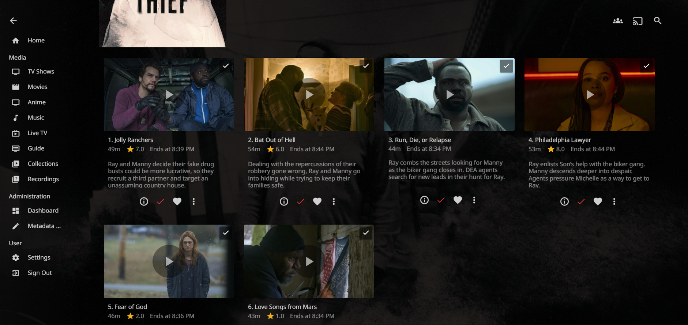
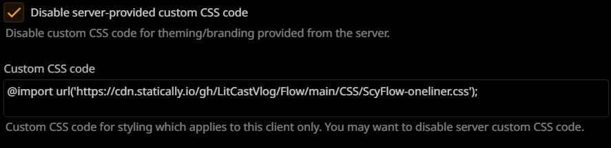

# **MLP-inspired theme for Jellyfin WebUI**
### **Fork of [Flow](https://github.com/LitCastVlog/Flow/), [Scyfin](https://github.com/loof2736/scyfin/), [Ultrachromic](https://github.com/CTalvio/Ultrachromic)**

[Go to installation](#installation)

---

### PonyFin Features
- Home Button Icons 
      
 - Action Button Icons 
      
 - Pinkie Spinner 
      
 - Nyan Rainbow Dash Progress Bar 
      
 
### **Enable Backdrop Support**

### Install PonyFin (Manual): 
Install Base Theme (Flow): 

`@import url('https://cdn.statically.io/gh/Cha0s-Rat/PonyFin/main/CSS/ScyFlow-main.css');`

 Install Spinner/Progress Bar: 
 
`@import url('https://cdn.statically.io/gh/Cha0s-Rat/PonyFin/main/CSS/PonyFin-main.css');`
 
 
Install Home Icons (Need to zoom out if icons are cut off, doesn't work on mobile, will release a mobile fix eventually):

`@import url('https://cdn.statically.io/gh/Cha0s-Rat/PonyFin/main/CSS/PonyFin-HomeButtons.css');` 
 
 
Install Action Buttons:

`@import url('https://cdn.statically.io/gh/Cha0s-Rat/PonyFin/main/CSS/PonyFin-ActionButtons.css');`
 
 
Install Rainbow Animated BG Overlay (Enable Backdrops):
 
`@import url('https://cdn.statically.io/gh/Cha0s-Rat/PonyFin/main/CSS/PonyFin-AnimatedBGRainbow.css');`

Install Rainbow Theme (Doesn't work on JMP, defaults to Pink):

`@import url('https://cdn.statically.io/gh/Cha0s-Rat/PonyFin/main/CSS/PonyFin-Rainbow.css');` 
---
### WIP: Android/iPad: 
  
  

---
Flow/Scyfin Addons:

### Extras (*smaller cast/crew, etc*) 
`@import url('https://cdn.statically.io/gh/Cha0s-Rat/PonyFin/main/CSS/ScyFlow-Extras.css');`

 - Smaller Cast/Crew section
 - Hide "Upcoming on TV" and "Next Up" sections in Season View

### Options (Add these after/under the base theme)
- Enable Collapsible Drawer/Menu 
    - `@import url('https://cdn.statically.io/gh/LitCastVlog/Flow/main/CSS/ScyFlow-Drawer-Toggle.css');`
      
- Bigger logo (for High DPI/Jellyfn Media Player)
    - `@import url('https://cdn.statically.io/gh/LitCastVlog/Flow/main/CSS/ScyFlow-HighDPIExtras.css');`
      
- Episode Grid (from [Ultrachromic](https://github.com/CTalvio/Ultrachromic))
    - `@import url('https://cdn.statically.io/gh/LitCastVlog/Flow/main/CSS/ScyFlow-EpisodeGrid.css');`
      
- Round Cast/Crew/Guests
    - `@import url('https://cdn.statically.io/gh/LitCastVlog/Flow/main/CSS/ScyFLow-RoundCastCrew.css');`
      
        
  # Compatible with Flow/Scyfin/Ultrachromic themes:
  
    - Orange
        - `@import url('https://cdn.statically.io/gh/LitCastVlog/Flow/main/CSS/Themes/ScyFlow-Orange.css');`
        - 
    - Pink
        - `@import url('https://cdn.statically.io/gh/LitCastVlog/Flow/main/CSS/Themes/ScyFlow-Pink.css');`
        - 
    - Rainbow
        - `@import url('https://cdn.statically.io/gh/LitCastVlog/Flow/main/CSS/Themes/ScyFlow-Rainbow.css');`
        - 
    - Red
        - `@import url('https://cdn.statically.io/gh/LitCastVlog/Flow/main/CSS/Themes/ScyFlow-Red.css');`
        - 
    - White
        - `@import url('https://cdn.statically.io/gh/LitCastVlog/Flow/main/CSS/Themes/ScyFlow-White.css');`
        - 
    - Blue
        - `@import url('https://cdn.statically.io/gh/LitCastVlog/Flow/main/CSS/Themes/ScyFlow-Blue.css');`
        - 

   - Darker icons/OLED accents (Add this after everything else):
        - `@import url('https://cdn.statically.io/gh/LitCastVlog/Flow/main/CSS/Themes/ScyFlow-Dark.css');`
   
 
  # Experimental (Works in progress)
    - Episode Grid Outline/Dim on hover
        - `@import url('https://cdn.statically.io/gh/LitCastVlog/Flow/main/CSS/ScyFlow-EpisodeGrid-outline.css');`
        - 
    - Horizontal-Scroll Episodes
        - `@import url('https://cdn.statically.io/gh/LitCastVlog/Flow/main/CSS/ScyFlow-Scrollable-Episodes-WIP.css');`
        - 
    - Horizontal-Scroll Episodes (alt, controls overlayed)
        - `@import url('https://cdn.statically.io/gh/LitCastVlog/Flow/main/CSS/ScyFlow-Scrollable-Episodes-ALT.css');`
        - 
    - Animated Overlay (on Backdrops and Live TV section)
        - `@import url('https://cdn.statically.io/gh/LitCastVlog/Flow/main/CSS/ScyFlow-AnimatedOverlay.css');`
        - 
   - Nyan Progress Bar
        - `@import url('https://cdn.statically.io/gh/LitCastVlog/Flow/main/CSS/Themes/NyanProgress.css');`
        -   
---

### **Installation:**

### Easy install (one-liner) 
## `@import url('https://cdn.statically.io/gh/Cha0s-Rat/PonyFin/main/CSS/PonyFin-Oneliner.css');` 

#### WIP: iPad Oneliner: `@import url('https://cdn.statically.io/gh/Cha0s-Rat/PonyFin/main/CSS/PonyFin-Oneliner-iPad.css');` 
#### WIP: Android Oneliner: `@import url('https://cdn.statically.io/gh/Cha0s-Rat/PonyFin/main/CSS/PonyFin-Oneliner-Smallscreen.css');` 

**Server-wide install:**
* Click the hamburger icon (Top left)
* Navigate to "Dashboard" (If you don't see this, make sure you are signed in to your admin account)
* Navigate to "General"
* Near the bottom, under "Custom CSS code", paste the `@import url` for the base theme
    * Example:
    * 
* Optional - Paste the `@import url` for any options / themes / addons you may want
    * Example:
    * 
* Click "Save"

---

**Single client install:**
* Click the hamburger icon (Top left)
* Navigate to "Settings"
* Navigate to "Display"
* Near the middle, under "Custom CSS code", paste the `@import url` for the base theme
    * Note - 
        * If there is any server-wide custom CSS, you may want to enable "Disable server-provided custom CSS code", as the two themes WILL interfere with each other
    * Example:
    * 
* Optional - Paste the `@import url` for any options / themes / addons you may want
    * Example:
    * 
* Click "Save"

---
  ###Credits:
  All MLP pixel art by [Botchan-MLP](https://www.deviantart.com/botchan-mlp)
  Base theme is [Flow](https://github.com/LitCastVlog/Flow) (fork of Scyfin/Ultrachromic)
